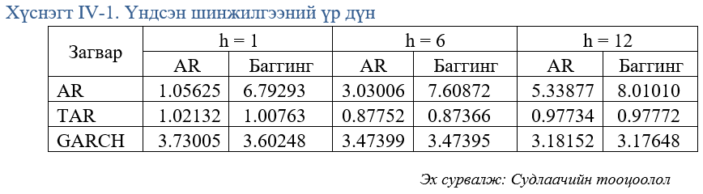
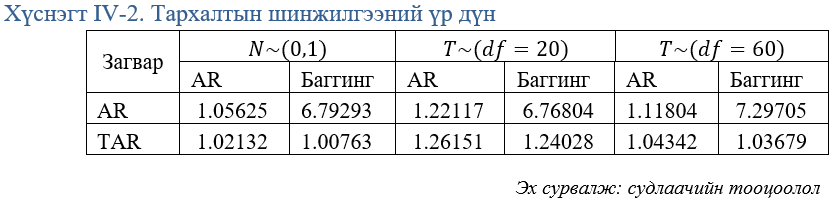
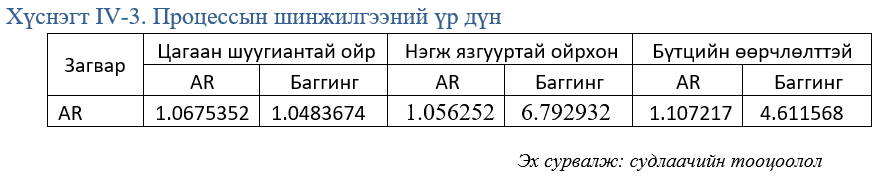

# Агуулга

1. Оршил
2. Судлагдсан байдал
  + Хугацааны цуваан таамаглалтай, түүх хөгжил
  + Баггинг аргазүй ашигласан таамаглалын ажлууд
  + Машин сургалт түүний эдийн засгийн хэрэглээ
3. Онолын ухагдахуун, аргазүй
4. Симуляцийн төлөвлөгөө
5. Симуляцийн үр дүн
6. Дүгнэлт санал

---
# Оршил

- Хугацаан цувааны таамаглалд загварын тодорхой бус байдал голлох бэрхшээлүүдийн нэг байдаг. Тухайн түүврийн хувьд сайн тохирч байна гэдэг нь энэ загвар оновчтой таамаглал хийнэ гэсэн үг биш юм. 

- Энэхүү судалгааны ажил нь машин сургалтын баггинг аргазүйн гүйцэтгэлийг хэмжих зорилготой симуляцийн судалгаа бөгөөд Авторегрессив загвар (АR), threshold Авторегрессив загвар (TAR) болон  Ерөнхийлсөн Авторегрессив Нөхцөлт Хетероскедастик (GARCH) өгөгдөл үүсгэх процессуудыг ашиглана.

---
# Зорилго, зорилт

Энэхүү судалгааны гол зорилго нь таамаглалын загваруудыг симуляцийн аргаар шинжлэн, харьцуулах билээ. Энэ зорилгыг ойлгомжтой, дэс дараалалтай болгохын тулд дараах зорилгуудад хувааж болох юм. Үүнд:

- Сүүлийн 30 жилийн хугацааны цуваан таамаглалын загваруудын хөгжлийн түүхийг хураангуйлах, мөн баггинг аргазүйтэй холбоотой судалгааны ажлуудын үр дүнг дурдах 
- Баггинг аргазүйг тоймлон аргазүйн талаас судлах
- Симуляцийн судалгааг төлөвлөх
- Монте-Карло симулцийн үр дүнг харуулах
- Шинжилгээний үр дүнд үндэслэн дүгнэлт санал боловсруулах зэрэг багтана.

---
class: inverse, center, middle

# Судлагдсан байдал

---

# Хугацаан цувааны таамаглал

- Экспоненциал гөлийлгөлт 
  + 1950-1960-аад онд Браун, Холт, Уинтерс (1960) 
  + Хандлагын 5, улирлын 3 хэлбэрийг ашигладаг
  + Хиндман (2001) - Нэгдүгээр эрэмбийн ARIMA загвараас илүү сайн гүйцэтгэлтэй
  + Аргазүйн шүүмжлэлийн нэг нь таамаглалын интервал гарган авах боломжгүй

- ARIMA 
  + Юлегийн (Yule, 1927) - Стохастик процесс
  + Слуцкий, Уокер, Яглом, Юле - авторегрессив (АR) дараа нь хөдөлгөөнт дундаж (MA)
  + Бокс ба Женкинс (1970) - "Хугацааны цуваан шинжилгээ: Таамаглал ба удирдлага"
---

# Баггинг аргазүй

- Баггинг нь таамаглалын загварын тодорхой бус байдалд нарийвчлалыг сайжруулахад зориулагдсан статистик аргазүй юм. (Breiman, 1996)
- Хирано ба Райт (2017) нар нь таамаглагч хувьсагчдын сонголтын талаар тодорхой бус үед Рао Блэквеллийн теорем ба Багингын дагуу таамаглалын загвараа сонгож гүйцэтгэлийг харьцуулах судалгаа хийсэн.
- Иноуе, Килиан (2008) нар АНУ-ын ХҮИ-ийн хугацаан цувааг таамаглахдаа хэд хэдэн загваруудыг баггингтай болон баггинггүй харьцуулж үзсэн бөгөөд үүнд регрессийн загварууд, фактор загвар болон агшаасан регрессийн загварууд (ЛАССО-той) хамаарна. 
- Жин, Су, Уллах (2014) - Монте Карло симуляци нь энэхүү арга уламжлалт нэг алхамт шугаман таамаглал болон параметрийн бус таамаглалд ерөнхийдөө сайн гүйцэтгэлтэй, түүврийн хэмжээ бага байхад ч гайхалтай үр дүнтэй байгааг харуулж байна.

---

class: inverse, center, middle

# Онол, аргазүй

---

# Баггинг аргазүй

Бүүтстрап нэгтгэл буюу баггинг аргазүй нь статистик сургалтын аргуудын вариацыг бууруулах зорилготой.
Бие биеэсээ үл хамаарах, $\sigma^2$ вариацтай  $n$ ширхэг үл хамаарах $Z_1,..,Z_n$ ажиглалт өгсөн гэвэл дундаж нь болох $\bar Z$ – ийн вариац $Z$ болно. Өөрөөр хэлбэл ажиглалтуудыг дундажлах нь вариацыг бууруулдаг

$$\hat f _{avg}(x)= \frac{1}{b} \sum_{b=1}^{B} \hat f ^{*b}(x)$$

- Таамаглалын вариацыг бууруулах, нарийвчлалыг сайжруулах уламжлалт арга нь  эх олонлогоос маш олон сургалтын өгөгдөл салган авч, тус бүрд нь таамаглалын загвар боловсруулж, үр дүнг дундажлах явдал билээ. 

---
class: inverse, center, middle

# Монте-Карло симуляци

---

# Өгөгдөл үүсгэх процесс (ӨҮП)

- Бид судалгаандаа практикт хамгийн түгээмэл ашиглагддаг, хэвийн тархсан үлдэгдэл санамсаргүй хэмжигдэхүүн бүхий авторегрессив (АR), threshold авторегрессив загвар (TAR) болон  Ерөнхийлсөн авторегрессив нөхцөлт хетероскедастик (ЕАНХ) процессуудыг авч үзэх болно.

$$AR(2):y_t=0.5y_{t-1}+0.45y_{t-2}+\varepsilon_t$$

$y_t=0.1y_{t-1}+0.09y_{t-2}+\varepsilon_t$  энд $|y_{t-1}|\le 0$ 
$y_t=0.2y_{t-1}+0.05y_{t-2}-\varepsilon_t$  энд $|y_{t-1}|>0$

$$GARCH(2,2):y_t^2 =0.12y_{t-1}^2+0.04y_{t-2}^2+0.08\varepsilon^2_{t-1}+0.05\varepsilon_{t-2}^2+\varepsilon_t$$

$$\varepsilon_t ~ N(0,1)$$

---

# Шинжилгээний хувилбар

 Ерөнхий тавил : 100 урттай хугацааны цуваа, 500 удаагийн симуляци, 100 удаагийн бүүтстрап

|Шинжилгээний төрөл         |  Хувилбарууд|||
|:-------------------------:|:----:|:---:|:----:|
|Үндсэн шинжилгээ| h=1|   h=6| h=12|
|Тархалтын шинжилгээ        | $N ~ (1,0)$ | $T ~ (df=20)$ | $T ~ (df=60)$ | 
|Процессын шинжилгээ        | Цагаан шуугиантай ойр|Нэгж язгууртай ойрхон|Бүтцийн өөрчлөлттэй| 

---
# Симуляцийн алхам

Симуляцийг дараах алхмуудын дагуу гүйцэтгэнэ:

1. Харгалзах ӨҮП бүрд 100 урттай симуляцийн цуваа үүсгэх
2. Тухайн цувааг АR(2) загвараар загварчилж, дараагийн h үеийн таамаглалыг хийх замаар $y_{t+h}^{org}$ гаргаж авах
3. Тухайн цувааг блок бүүтстрап хийх замаар B ширхэг цуваа гарган авч АR(2) загвараар таамаглал хийж үр дүнг дундажлах `$$y_{t+h}^{bag} = \frac {\sum_{i=1}^{B}y_{t+h}^B}{B}$$`
4. Гуравдугаар алхамын үр дүн бодит утгатай харьцуулах
5. 1-4 дэхь алхмыг 100 удаа давтах 
6. Нэгдсэн MSE болон гажуудлыг хэмжих

---
class: inverse, center, middle
# Симуляцийн үр дүн

---

# Үндсэн шинжилгээ

Үндсэн шинжилгээний гол зорилго нь AR загварын болон баггинг ашиглаж нэгтгэн дундажласан таамаглалын утга бодит утгаасаа хэр ялгаатай байгааг шинжлэх  өөрөөр хэлбэл MSE -ийн тусламжтай баггинг аргазүй таамаглалын нарийвчлалд хэрхэн нөлөөлж буйг хэмжих.
 

Баггинг аргазүйн MSE нь TAR болон GARCH ӨҮП-ийн хувьд сайн гүйцэтгэлийг өгч байна. 

---

#  Тархалтын шинжилгээ

Тархалтын шинжилгээний гол зорилго нь үлдэгдэл санамсаргүй хэмжигдэхүүний тархалт таамаглалын гүйцэтгэлд хэрхэн нөлөөлөхийг авч үзэх билээ.

Энэ нь загвар буруу тодорхойлогдсон бөгөөд үлдэгдэл санамсаргүй хэмжигдэхүүний тархалт хэвийн бус хуульд захирагддаг тохиолдолд баггинг аргазүй үр ашигтай байх хандлагатайг илтгэж байгаа юм.

---

# Процессын шинжилгээ

Энэхүү шинжилгээний хэсгийн зорилго нь ӨҮП-аар үүсгэсэн симуляцийн цуваа маань нэгж язгууртай ойрхон, цагаан шуугиантай ойрхон эсвэл бүтцийн өөрчлөлттэй байгаа тохиолдолд баггинг аргазүйн гүйцэтгэл хэрхэн өөрчлөгдөж буйг дүгнэх билээ. 

Нэгж язгууртай ойр болон бүтцийн өөрчлөлттэй үед блок бүүтстрап хийх нь тохиромжгүй гэдгийг харуулж байна.

---
# Дүгнэлт, санал  

1. TAR, GARCH загвараар үүсгэсэн симуляцийн хувьд баггинг аргазүй таамаглалын гүйцэтгэлийг сайжруулах боломжтойг оллоо.
  + Таамаглалын тодорхой бус байдалд баггинг аргазүйн тусламжтай гүйцэтгэлийг сайжруулах боломжтой.
  + бүүтстрапийн тоог хангалттай их түвшин байлгах хэрэгтэй
  + уг процесс нэгж язгууртай ойрхон бол бүүтстрап дахин түүвэрлэлт тохиромжгүй.

2. Судалгааны ажлыг бодит амьдрал дээрх өгөгдлөөр өргөтгөх нь ач холбогдолтой юм.

3. Баггинг аргазүйг илүү нарийвчилсан, илүү том загварууд дээр ашиглах хэрэгтэй. 
--- 

---

#Ашигласан материал

1. [Симуляци хийсэн R code](https://www.kaggle.com/lkhagwasuren/simulation)
2. Breiman, L. (1996). Bagging predictors. *Machine learning*, 26(2), 123-140.
3. Box, G. E. P., & Jenkins, G. M. (1970). Time series analysis:Forecasting and control. San Francisco: Holden Day.
4. Hirano, K., & Wright, J. H. (2017). Forecasting with model uncertainty: Representations and risk. *Econometrica*, 85(2), 617–643.
5. Inoue, A., & Kilian, L. (2008). How useful is Bagging in forecasting economic time. *Journal of the American Statistical Association*, 103(482), 511–522. 
6. Yule, G. U. (1927). On the method of investigating periodicities in disturbed series, with special reference to WolferTs sunspot numbers. *Philosophical Transactions of the Royal Society London*, Series A, 226, 267– 298.
---

#Асуулт, санал зөвлөмж

<dev class = "center" >
Анхаарал тавьсан явдалд баярлалаа.
</dev>

